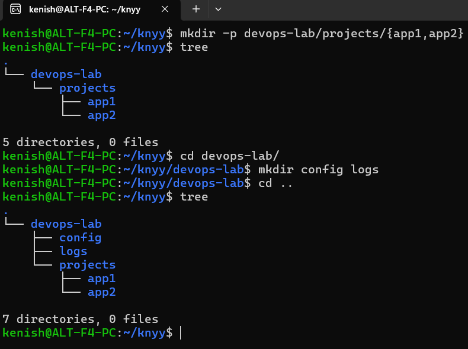
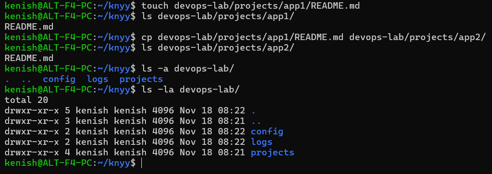

# Linux Command Line Basics

1. *mkdir -p devops-lab/projects/{app1,app2} is executed — this creates a directory structure with devops-lab/projects, and inside it, two subdirectories: app1 and app2. The -p flag ensures that parent directories are created if they don't exist, and the {app1,app2} syntax creates both folders in one command.*

2. *Then, tree is executed — this displays the directory structure in a visual tree format. The output confirms that only the projects/app1 and projects/app2 directories exist under devops-lab.*

3. *cd devops-lab/ is executed — this navigates into the devops-lab directory.*

4. *Inside devops-lab, mkdir config logs is executed — this creates two new directories, config and logs, at the same level as projects.*

5. *The command cd .. then goes back to the parent directory (the home or root of the current path).*

6. *Finally, another tree command shows the updated full structure, now including config and logs alongside projects inside devops-lab.*

1. *touch devops-lab/projects/app1/README.md is executed — this creates an empty file named README.md inside the app1 directory.*

2. *Then, ls devops-lab/projects/app1/ is executed — this lists the contents of the app1 directory, confirming that README.md exists.*

3. *cp devops-lab/projects/app1/README.md devops-lab/projects/app2/ is executed — this copies the README.md file from app1 to the app2 directory.*

4. *After that, ls devops-lab/projects/app2/ is used — this lists the contents of app2, showing that the file was successfully copied.*

5. *The user then runs ls -a devops-lab/ — this lists all files and directories in devops-lab, including hidden ones (those starting with a dot). The output shows config, logs, projects, and hidden entries like . and ...*

6. *Finally, ls -la devops-lab/ is executed — this displays detailed information (permissions, owner, size, and modification date) for all items in devops-lab.*