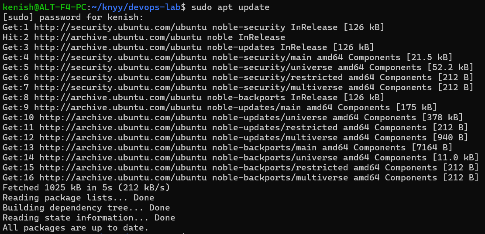
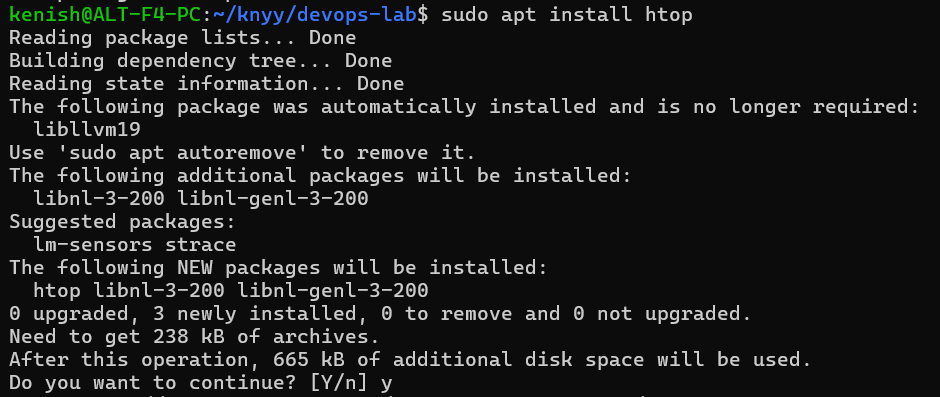
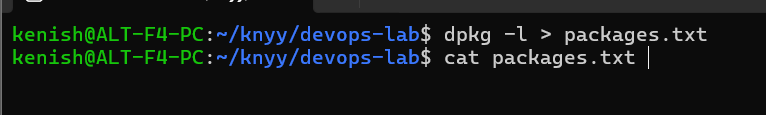

# Package Management

- 

1. *sudo apt update is executed — this updates the list of available software packages from online sources. The sudo part gives administrative permission, apt is the package manager and update refreshes the local database.*

---

- 

1. *sudo apt install htop is executed — this starts the installation of htop, an interactive process viewer for Linux. The sudo command gives administrative privileges.*

---

- 

1. *dpkg -l > packages.txt is executed — this lists all installed packages on the Debian-based Linux system using dpkg -l and saves the output into a file called packages.txt in the current directory. The > symbol redirects the screen output to the file.*

---
