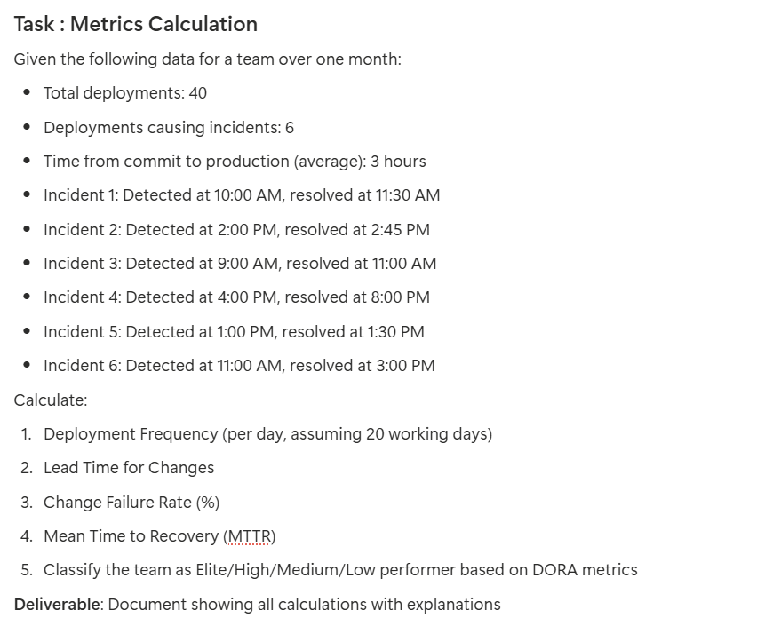

# Metrics Calculation

*Given*
- *Total deployment: 40*
- *Deployment causing incidents: 6*
- *Working Days: 20*
- *Lead Time for Change (average): 3 hours*
- *Incident detection + resolution times:*
1. 10:00 AM → 11:30 AM
2. 2:00 PM → 2:45 PM
3. 9:00 AM → 11:00 AM
4. 4:00 PM → 8:00 PM
5. 1:00 PM → 1:30 PM
6. 11:00 AM → 3:00 PM

*now,*

1. *Deployment Frequency (per day) =* 
*Deployment Frequency = 40/20*               
*2 deployment per day* 
*Answer: 2 deployment per day*

2. *Lead Time for Changes* 
*Given average time from commit → production:* 
*Lead Time = 3 hours*

3. *Change Failure Rate (CFR)* 
CFR= 6/40*100% = 15% 
*Change Failure Rate = 15%*

4. *Mean Time to Recovery (MTTR)* 
*Calculate duration of each incident:*

*Incident Durations* 
- 10:00 → 11:30 = 1 hr 30 min = 1.5 hrs
- 2:00 → 2:45 = 45 min = 0.75 hrs
- 9:00 → 11:00 = 2 hrs
- 4:00 → 8:00 = 4 hrs
- 1:00 → 1:30 = 30 min = 0.5 hrs
- 11:00 → 3:00 = 4 hrs

*Total Recovery Time* 
1.5 + 0.75 + 2 + 4 + 0.5 + 4 = 12.75 hrs

*MTTR* 
12.75/6 = 2.125 hrs 
*MTTR = 2.125 hours*

