# Launch an EC2 and establish a ssh connection

## What is Amazon EC2?
    Amazon EC2 (Elastic Compute Cloud) is a service from AWS that 
    lets you create and run virtual computers (called instances) in the cloud.

    Think of EC2 as:

    - A computer in the cloud that you can turn on, configure, and connect to anytime you want.
    - User can install software, host websites, run apps, do testing, etc.
    - User only pay for the time the computer is running.

---

## How to launch an EC2 & establish a ssh connection (step-by-step) 

**Step-1: Search for EC2 in AWS Console**

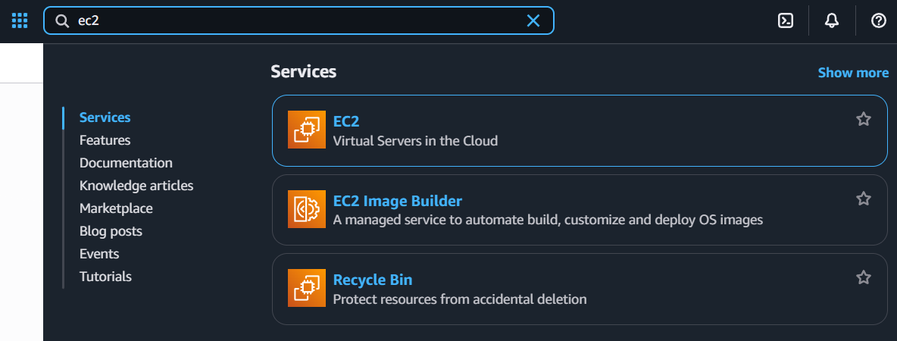

    In the AWS Management Console, I searched for “EC2” using the top search bar. 
    From the search results, I selected the EC2 service (Virtual Servers in the Cloud) 
    to begin launching a new EC2 instance.

---

**Step-2: Click “Launch instance"**

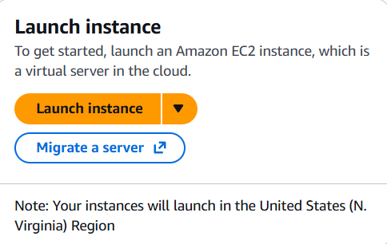

    After opening the EC2 dashboard, I clicked the “Launch instance” button.
    This starts the process of creating a new EC2 virtual machine in the cloud.
    The console also shows the region where the instance will be launched 
    (in this case, N. Virginia).

---

**Step-3: Give EC2 instance a name**

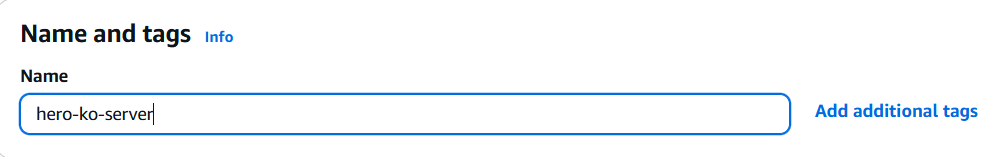

    In the Name and tags section, I entered a name for my EC2 instance:
    "hero-ko-server" 

--- 

**Step-4: Choose an Amazon Machine Image (AMI)**

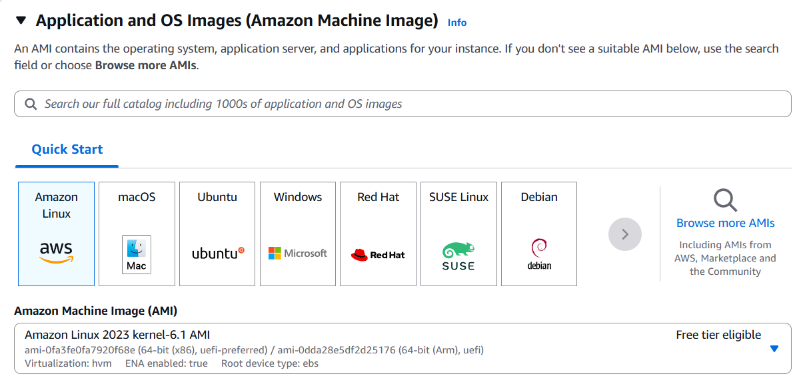

    Next, I selected the operating system for my EC2 instance. AWS provides several 
    options like Amazon Linux, Ubuntu, Windows, and more. For this setup, 
    I selected: Amazon Linux 2023 (Free tier eligible)

    **NOTE** An AMI (Amazon Machine Image) is a ready-made template that 
    contains the operating system and basic setup needed to launch an EC2 virtual server.

---

**Step-5: Select an Instance Type**

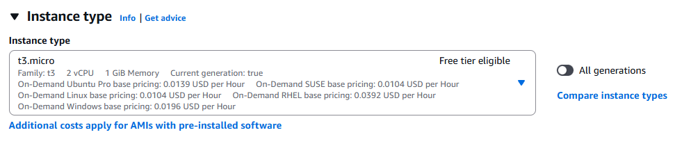

    In this step, I selected the instance type, which defines how much CPU and 
    memory my EC2 server will have.

---

**Step-6: Create or Select an SSH Key Pair**

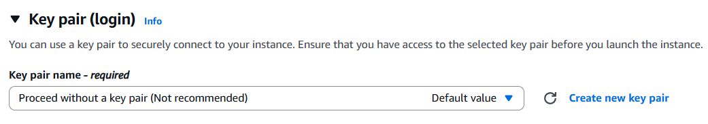

    To enable secure SSH access to the EC2 instance, I clicked “Create new key pair.”

    A key pair contains:

    - Public key → stored in AWS
    - Private key (.pem or .ppk file) → downloaded to my local machine

    **NOTE** This private key is required later when connecting to the EC2 instance 
    using SSH.

---

**Step-7: Configure and Download the Key Pair**

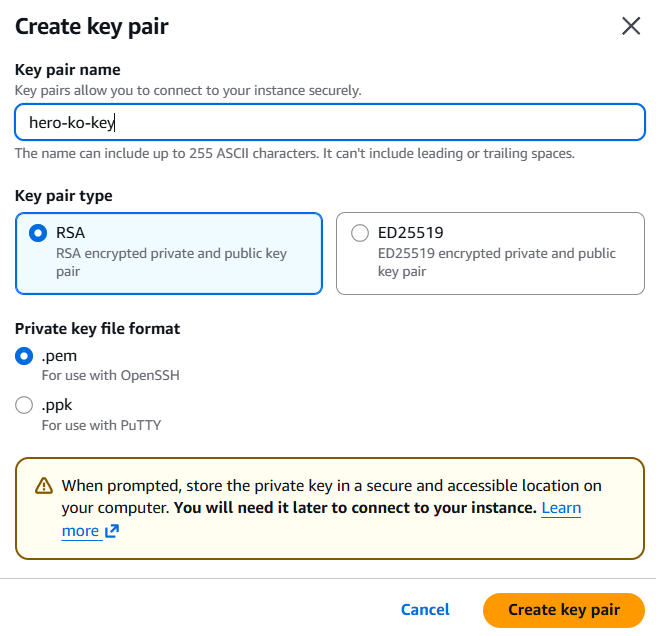

    I created a new SSH key pair with the following settings:
    - Key pair name: hero-ko-key
    - Key pair type: RSA
    - Private key format: .pem (used for SSH on Linux/Mac/Windows PowerShell)

    After clicking Create key pair, AWS downloaded the .pem file to my computer. 
    This file is important because it allows me to securely SSH into the EC2 instance.

---

**Step-8: Configure Network and Security Group**

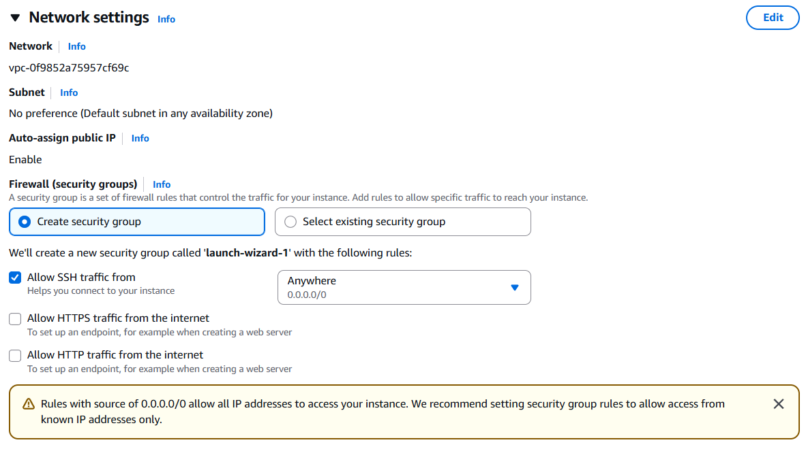

    In the Network settings, AWS automatically selected the default VPC and subnet. 
    I kept Auto-assign public IP enabled so I can SSH into the instance from the internet.

    I also created a new Security Group with the rule:
    - Allow SSH traffic from: Anywhere (0.0.0.0/0)

    This rule allows SSH connections to the instance so I can log in using my key pair.
    (For better security, this can be restricted to your own IP.)

    **NOTE** A Security Group (SG) is a virtual firewall in AWS that controls 
    which types of traffic are allowed to reach your EC2 instance.

---

**Step-9: Configure Network and Security Group**

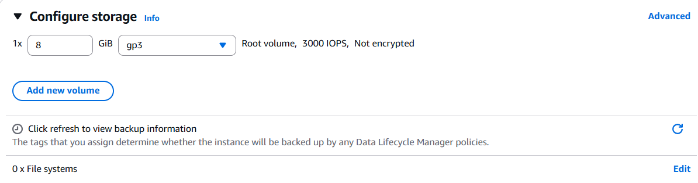

    In this step, I kept the default storage settings for the EC2 instance:
    - Root volume size: 8 GiB
    - Volume type: gp3 (General Purpose SSD)

    This storage acts as the EC2 instance's main disk where the operating system 
    and files will be stored.

---

**Step-10: Review and Launch the EC2 Instance**

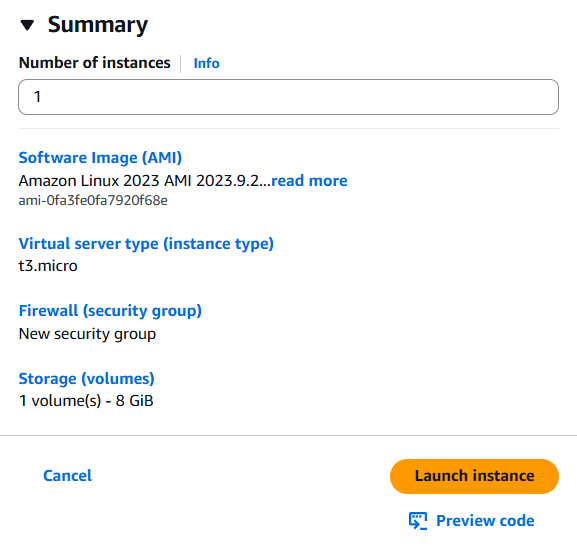

    In the Summary section, I reviewed all the settings:
    - AMI: Amazon Linux 2023
    - Instance type: t3.micro
    - Security group: New group with SSH access
    - Storage: 8 GiB gp3 volume

    Everything looked correct, so I clicked Launch instance to create the EC2 
    server.

---

**Step-11: EC2 Instance Successfully Launched**

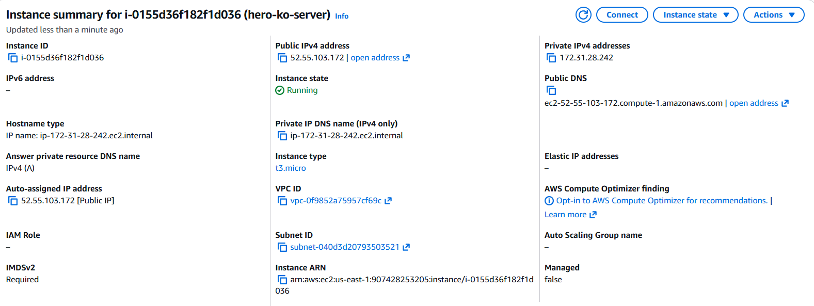

    After launching, I was taken to the Instance Summary page.
    Here I can see important details about my new EC2 instance:
    - Instance state: Running
    - Public IPv4 address: 52.55.103.172 (used for SSH access)    

    This confirms that the EC2 server is active and ready for SSH connection.

---

**Step-12: Connect to EC2 via SSH**

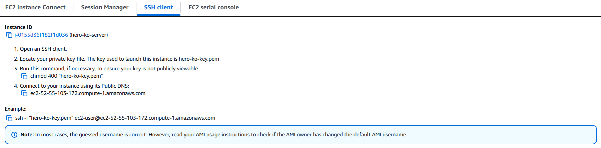

    To connect to the EC2 instance, I opened the SSH client tab.
    AWS provides the exact steps needed:
    - Open a terminal on your computer.
    - Make sure the private key file (hero-ko-key.pem) is on your system.
    - Set the correct permissions.

---

**Step-13: Verify SSH Port Connectivity**

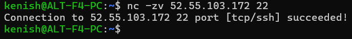

    On my local computer, I used the nc (netcat) command to check 
    if my EC2 server was reachable on port 22 (SSH).
    This confirms that:
    - My local machine can reach the EC2 instance
    - Port 22 is open and allowed in the security group
    - The server is ready for SSH login

    # Netcat is a simple networking tool used to check if a server’s port 
    is open and reachable. 
    - -z → Scan/check the port without sending data
    - -v → Verbose mode (shows detailed output)

---

**Step-14: SSH Into the EC2 Instance from My Local Machine**

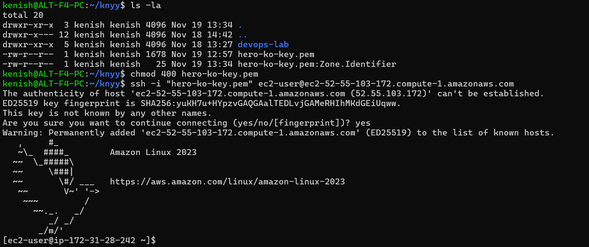

    On my local machine, I performed the following steps to connect to my EC2 instance:

    1. Checked that the key file exists                 
    2. Set correct permissions on the key file          
    3. Connected to the EC2 instance using SSH          
    4. Accepted the server fingerprint                  
    5. Successfully logged in 

    **NOTE** chmod 400 makes the key read-only and secure.

    **NOTE** -i tells SSH which private key file to use for authentication.
    SSH shows a fingerprint to verify the server’s identity. 
    
    **NOTE**I typed yes to trust the server and add it to my known_hosts.

---

    

