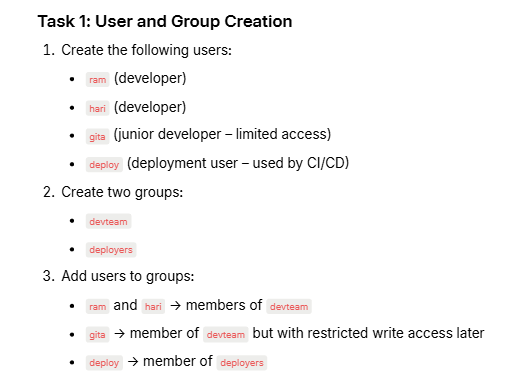
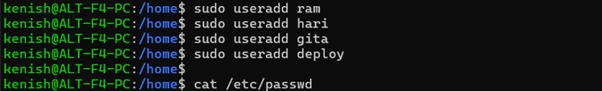
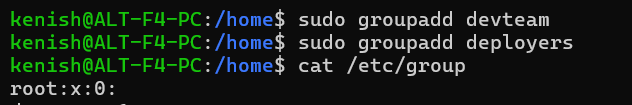

# User and Group Creation

---

    - sudo        : runs the command with admin/root privileges.
    - useradd     : command used to create a new user account.
    - cat         : displays the contents of a file.
    - /etc/passwd : system file that stores user details.

---

    
    - groupadd   : command to create a new group 
    - /etc/group : file that stores all group names and their members

---

    - usermod : modify an existing user
    - -a      : append (add without removing existing groups)
    - -G      : specify the group to add the user to
    - getent  : fetches system database entries

---
