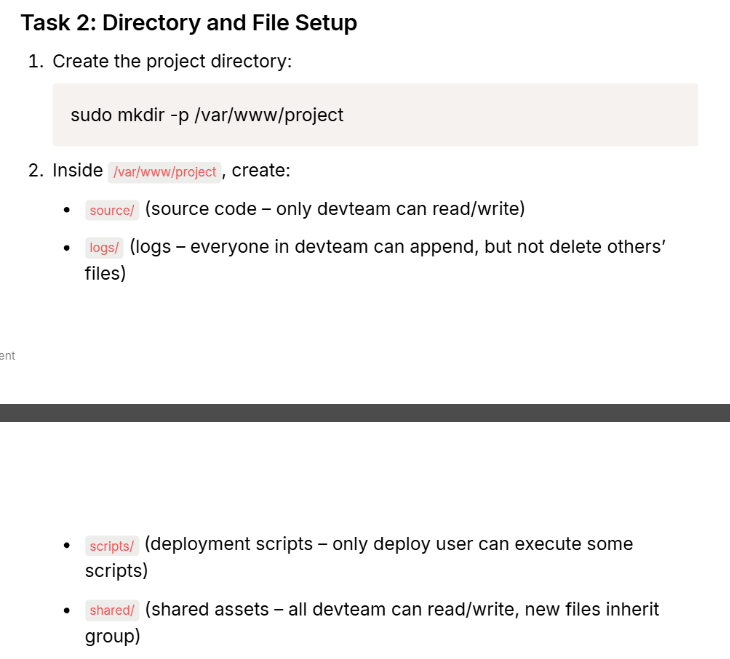
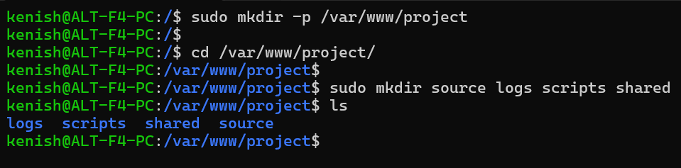

# Directory and File Setup

---

`For sudo mkdir -p /var/www/project`
     -p → creates the full path, including parent folders if they don’t exist

`For sudo mkdir source logs scripts shared`
    Creates four directories inside the project folder together.
