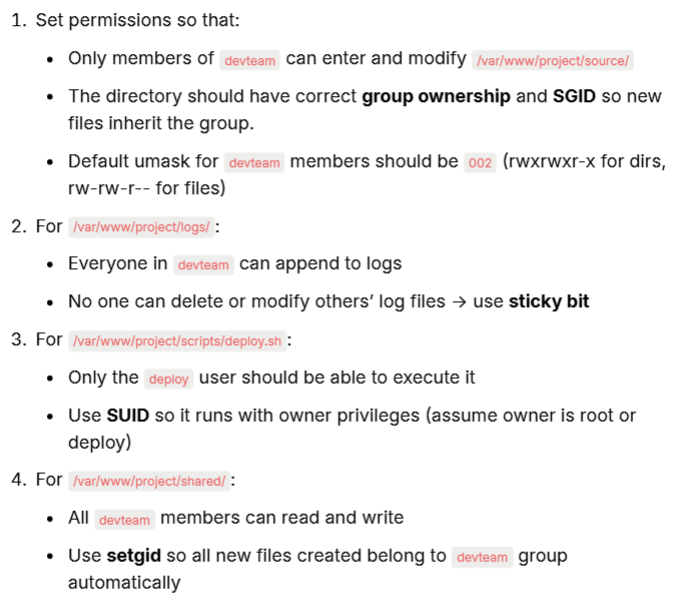
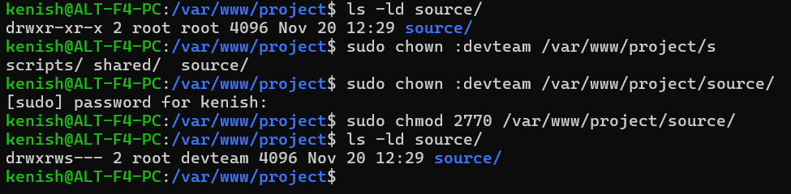
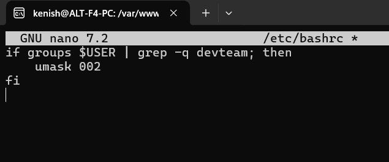
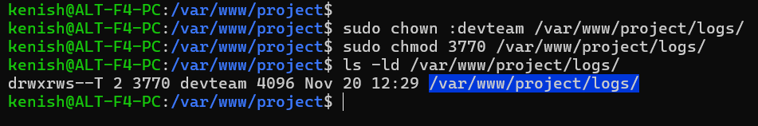
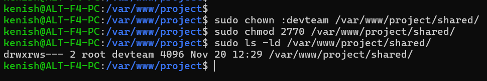

# Apply Correct Permissoions

---

    ls -ld source/ =  Shows detailed info (permissions, owner, group) of the source directory only.

    chown :devteam /var/www/project/source/ = 
    - chown    -> change ownership
    - :devteam -> change only the group to devteam (owner stays the same)
    - Makes devteam the group owner of the folder.

    chmod 2770 source/ = gives full access to owner + group, no access to others, and enables setgid (new files inherit the devteam group).

---

    nano /etc/bashrc

    groups $USER | grep -q devteam = 
    This checks if the current user is a member of the devteam group.

    umask 002
    If the user is in devteam, this sets default permissions so new files and folders are group-writable.
    - Directories → rwxrwxr-x
    - Files → rw-rw-r--

---

    chmod 3770 logs/ =  sets the following permissions:
    - 3 = SUID + sticky bit
    - 7 = full access for owner
    - 7 = full access for group
    - 0 = no access for others

    ls -ld logs/ = shows the updated permission of logs

    t = Sticky bit + others can enter the directory (x present)
    T = Sticky bit + others cannot enter the directory (x not present)

---

    chmod 4750 deploy.sh = 
    - 4 = SUID (script runs with the owner's permissions)
    - 7 = owner has full access
    - 5 = group has read + execute
    - 0 = others have no access

---

    chmod 2770 shared/ = 
    - 2 = setgid (new files inherit the group devteam)
    - 7 = owner has full access
    - 7 = group has read + execute
    - 0 = others have no access

---