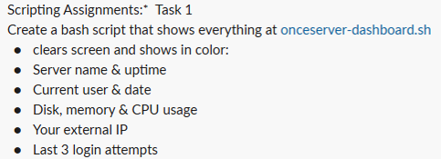

# TASK-1

---

    #!/bin/bash

    echo "------- SERVER DASHBOARD -------"
    echo "1) Server name & uptime"
    echo "2) Current user & date"
    echo "3) Disk, Memory & CPU usage"
    echo "4) External IP"
    echo "5) Last 3 login attempts"
    echo "6) Show everything"
    echo "0) Exit"

    echo ""
    read -p "Enter your choice: " choice

    echo "" 
    echo "----- OUTPUT -----"
    echo ""

    case $choice in

        1)
            echo "Server Name: $(hostname)"
            echo "Uptime: $(uptime -p)"
            ;;

        2)
            echo "Current User: $(whoami)"
            echo "Date: $(date)"
            ;;

        3)
            echo "Disk Usage:"
            df -h
            echo ""
            echo "Memory Usage:"
            free -h
            echo ""
            echo "CPU Usage:"
            top -bn1 | grep "Cpu(s)"
            ;;

        4)
            echo "External IP: $(curl -s ifconfig.me)"
            ;;

        5)
            echo "Last 3 login attempts:"
            last -n 3
            ;;

        6)
            echo "Server Name: $(hostname)"
            echo "Uptime: $(uptime -p)"
            echo ""
            echo "Current User: $(whoami)"
            echo "Date: $(date)"
            echo ""
            echo "Disk Usage:"
            df -h
            echo ""
            echo "Memory Usage:"
            free -h
            echo ""
            echo "CPU Usage:"
            top -bn1 | grep "Cpu(s)"
            echo ""
            echo "External IP: $(curl -s ifconfig.me)"
            echo ""
            echo "Last 3 login attempts:"
            last -n 3
            ;;

        0)
            echo "Exiting..."
            exit 0
            ;;

        *)
            echo "Invalid choice!"
            ;;
    esac

---

### QUICK SUMMARY TABLE

1. echo       --> print text on screen
2. read       --> take input from user
3. hostname   --> show server/computer name
4. uptime -p  --> show how long the system has been running
5. whoami     --> show current logged-in user
6. date       --> show current date and time
7. df -h      --> show disk storage usage
8. free -h    --> show memory (RAM) usage
9. top -bn1   --> show CPU usage (batch mode, 1 time)
10. grep       --> filter/search text
11. curl -s ifconfig.me  --> show public IP address
12. last -n 3  --> show last 3 login attempts
13. case..esac --> choose an action based on user input
14. exit 0     --> exit the script safely

---
