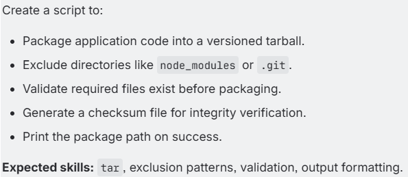
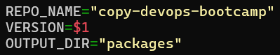
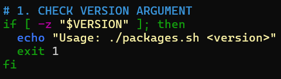
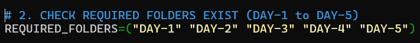
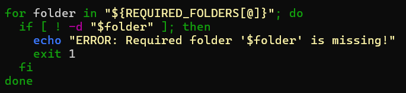
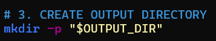
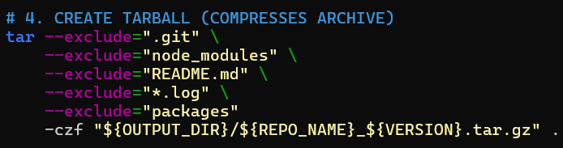
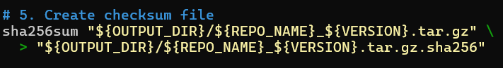
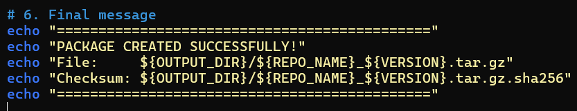

# TASK-1 

---

**1. Set Variables**

    1. REPO_NAME  = name of your project
    2. VERSION    = version number you type when running the script
    3. OUTPUT_DIR = folder where output files will be saved
    4. EXAMPLE:
    *./packages.sh 1.0.0
    Here 1.0.0 becomes $1.*

---

**2. Check if version is given**

    1. -z "$VERSION" = checks if no version was provided (-z = is empty)
    2. If missing, script shows how to use it and stops.

---

**3. List the required folders**

    1. REQUIRED_FOLDERS=("DAY-1" "DAY-2" "DAY-3" "DAY-4" "DAY-5")

---

**4. Check if the required folders exist**

    1. @  = everything in the list.
    2. -d = checks if a folder exists
    3. !  = means "not"

---

**5. Create the output folder**

    1. Makes a folder named packages/
    2. -p means = don’t show error if folder already exists

---

**6. Create a tarball (compressed archive)**

    1. tar             = tool to create compressed files
    2. --exclude="..." = skip unwanted files/folders
    3. -c              = create archive
    4. -z              = compress using gzip
    5. -f              = name of output file
    6. .               = package the current folder

---

**7. Create a checksum file**

    1. sha256sum =  makes a fingerprint of the tarball
    2. >         = writes that fingerprint into a .sha256 file
    3. Useful to verify file integrity later

---

**8. Show final message**

---

# Full Script

    #!/bin/bash

    REPO_NAME="copy-devops-bootcamp"
    VERSION=$1
    OUTPUT_DIR="packages"

    # 1. CHECK VERSION ARGUMENT
    if [ -z "$VERSION" ]; then
    echo "Usage: ./packages.sh <version>"
    exit 1
    fi

    # 2. CHECK REQUIRED FOLDERS EXIST (DAY-1 to DAY-5)
    REQUIRED_FOLDERS=("DAY-1" "DAY-2" "DAY-3" "DAY-4" "DAY-5")

    for folder in "${REQUIRED_FOLDERS[@]}"; do
    if [ ! -d "$folder" ]; then
        echo "ERROR: Required folder '$folder' is missing!"
        exit 1
    fi
    done

    echo "All required folders (DAY-1 to DAY-5) are present!"

    # 3. CREATE OUTPUT DIRECTORY
    mkdir -p "$OUTPUT_DIR"

    # 4. CREATE TARBALL (COMPRESSED ARCHIVE)
    tar --exclude=".git" \
        --exclude="node_modules" \
        --exclude="README.md" \
        --exclude="*.log" \
        -czf "${OUTPUT_DIR}/${REPO_NAME}_${VERSION}.tar.gz" .

    # 5. CREATE CHECKSUM FILE
    sha256sum "${OUTPUT_DIR}/${REPO_NAME}_${VERSION}.tar.gz" \
    > "${OUTPUT_DIR}/${REPO_NAME}_${VERSION}.tar.gz.sha256"

    # 6. FINAL MESSAGE
    echo "============================================="
    echo "PACKAGE CREATED SUCCESSFULLY!"
    echo "File:     ${OUTPUT_DIR}/${REPO_NAME}_${VERSION}.tar.gz"
    echo "Checksum: ${OUTPUT_DIR}/${REPO_NAME}_${VERSION}.tar.gz.sha256"
    echo "============================================="
