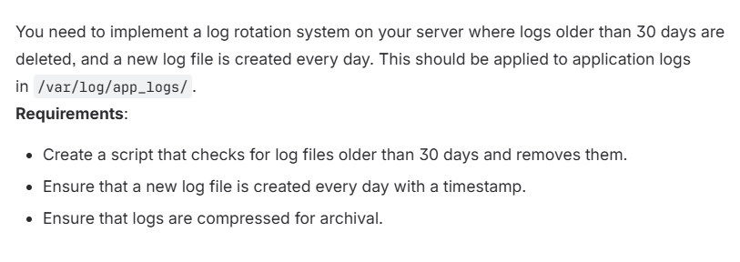
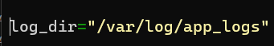
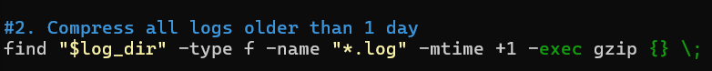
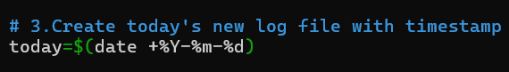

# TASK

---

    1. This creates a variable called LOG_DIR.
    2. It stores the location where all log files should be kept.

---

    1. mkdir      → creates a directory
    2. -p         → do nothing if the directory already exists
    3. "$LOG_DIR" → the log folder
    Meaning: Ensure the log folder exists before using it.

---

    1. find       → search for files
    2. "$LOG_DIR" → search inside this directory
    3. -type f    → only look for files
    4. -mtime +30 → files older than 30 days
    5. -delete    → delete those files
    Meaning: Remove all log files older than 30 days.

---

    1. find             → search for items
    2. "$LOG_DIR"       → inside the log directory
    3. -type f          → only files
    4. -name "*.log"    → only files ending with .log
    5. -mtime +1        → files older than 1 day
    6. -exec gzip {} \; → run the gzip command on each file found
        {} = the file name
        gzip = compresses the file
        \; = marks the end of the -exec command
    Meaning: Compress log files from yesterday and earlier into .gz files.

---

    date +%Y-%m-%d → prints today’s date.
    $( ) → runs the command and stores the output
    today= assigns that date to the variable today

---

# SCRIPT

    #!/bin/bash

    log_dir="/var/log/app_logs"
    mkdir -p "$log_dir"

    #1. Delete logs older than 30 days
    find "$log_dir" -type f -mtime +30 -delete

    #2. Compress all logs older than 1 day
    find "$log_dir" -type f -name "*.log" -mtime +1 -exec gzip {} \;

    #3.Create today's new log file with timestamp
    today=$(date +%Y-%m-%d)

    touch "$log_dir/app_log_$today.log"
    echo "Log rotation completed."

---
